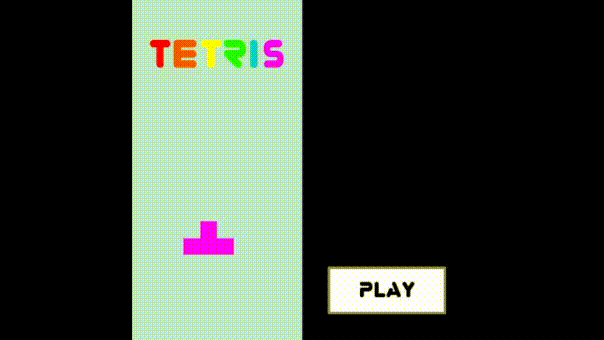

# Tetris

## Principe du jeu
Ce jeu est une copie revisitée du classique Tétris sorti en juin 1984 et publié par Elektronika 60. 
Il s'agit d'un jeu de puzzle où le but est de survivre le plus longtemps en s'aidant de pièces tombantes qu'il faut arranger au fur et à mesure pour prendre le moins de place possible et faire le plus grand score possible.

## Contrôles du jeu
- Pour bouger les blocs à gauche il faut utiliser la `flèche gauche`
- Pour bouger les blocs à droite il faut utiliser la `flèche droite`
- Pour descendre plus rapidement il faut appuyer sur la `flèche bas`
- Pour changer l'orientation du bloc il faut appuyer sur la `flèche haut`
- Pour poser le bloc d'un coup il faut appuyer sur la `barre espace`
- Pour mettre le jeu en pause il faut appuyer sur `Echap`

## Le score
Le joueur obtient :
- 10 points quand il arrive à poser une pièce
- 20 points quand il arrive à compléter 1 ou 2 lignes
- 50 points quand il arrive à compléter 3 lignes
- 100 points quand il arrive à compléter 4 lignes

Le meilleur score est enregistré à chaque nouvelle partie.

## Installation
Les différentes versions du jeu sont trouvables sur la page release de ce dépot -> <a href="https://github.com/Monophano/Tetris/releases">ici</a>

## Collaboration
Toute modification du programme dans le but d'améliorer le fonctionnement du jeu est la bienvenue.

## Bug
Merci de me prévenir quand vous trouvez un bug en ouvrant une discussion 😁.

## Dépendances relatives au code
La version de SFML utilisée dans cette application est la version 2.5.0 et la version de c++ utilisée est la c++ 17.
